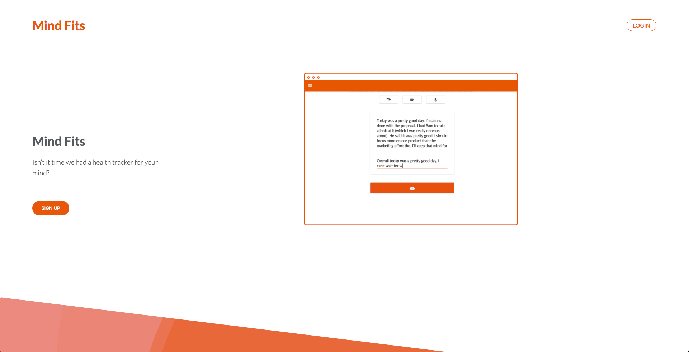
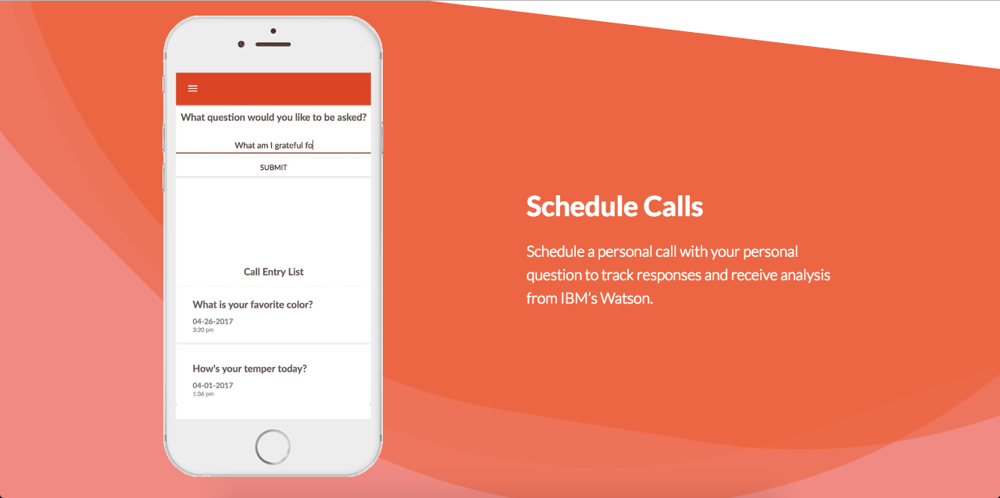
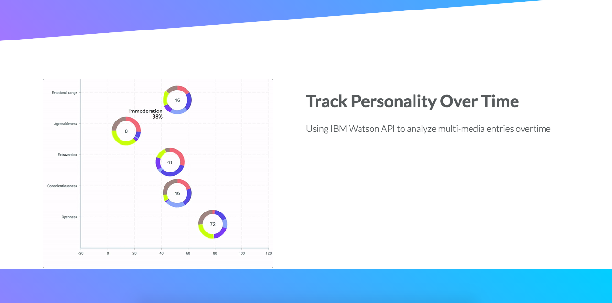
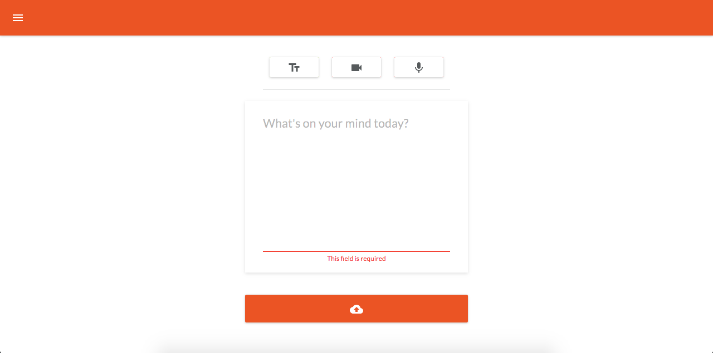
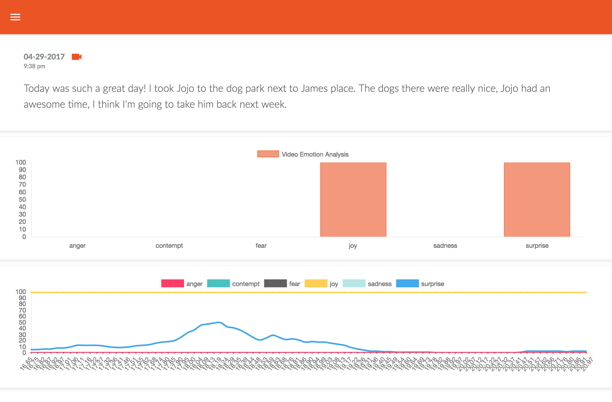

# Mind Fits
Daily journaling that analyzes your emotions



## Goals
Evoking mindfulness and improving emotional intelligence.

## Description
A web application that promotes personal and psychological hygiene through daily journaling. The journal entries accept text, speech, and video where the media is stored securely on AWS S3. The media is also transcribed with Web Speech API where the text is indexed in MongoDB and fed into IBM Watson API for tone analysis of entries. Video entries are being analyzed with Affectiva emotion recognition, and all entries can be collected and viewed with beautiful charts and visualizations. A call can also be scheduled to remind you of your entries. A Cron job is periodically scheduling those calls with the Twilio API, and for best results, it is highly recommended to use wake-up calls so that you streamline your thoughts as soon as you wake up. All entries are available to be viewed after submission and can be searched in real-time using Elastic Search.

Schedule Calls
:----------------------------------------------------------------------------------------------------:


Analyze Personality
:----------------------------------------------------------------------------------------------------:


Create New Entries
:----------------------------------------------------------------------------------------------------:


View Saved Entries
:----------------------------------------------------------------------------------------------------:


## Team

  - Brandon Wong
  - Eugene Song
  - Tim Nguyen
  - Whitney Zhu

## Table of Contents

1. [Usage](#Usage)
1. [Requirements](#requirements)
1. [Development](#development)
    1. [Installing Dependencies](#installing-dependencies)
    1. [Tasks](#tasks)
1. [Roadmap](#roadmap)
1. [Contributing](#contributing)

## Usage

This repository is the source of truth for MindFits application, used to:
 - Get a better understanding of underlying technologies that we used to build MindFits
 - Contribute to the project by openning pull request against the dev branch
 - Test existing APIs and components

## Technologies

### Frontend
- React (ES6)
- React Router
- Redux
- Material-UI
- Sass
- Web Speech API
- RecordRTC
- Affectiva
- ChartJS
- VictoryJS

### Backend
- Node
- Express
- MongoDB

### Other
- Heroku
- AWS S3
- Twilio
- IBM Watson
- Cron
- Elastic Search


## Requirements

- Node 6.4.x
- React 15.0.x
- React-redux 5.0.x
- Elastic Search 13.0.x


## Setup

From within the root directory:
clone down the repo
```
git clone https://github.com/bewty/bewty.git
```
cd to the root directory of the project
```
cd ./bewty
```
install dependencies
```
npm install
```
start database
```
mongod
```
Note: if this fails, try ``` sudo mongod ```

stand up server
```
npm run dev-server
```
start webpack
```
npm run dev-build
```
start hacking!

Follow steps for installing Elastic Search
https://www.elastic.co/downloads/elasticsearch

Create .env file to manage Watson, Twilio, AWS, and Elastic Search credentials as shown below
```
WATSON_ID= 
WATSON_PASS= 
TWILIO_ACCOUNT_SID=
TWILIO_SECRET= 
TWILIO_AUTH_TOKEN= 
TWILIO_TO= 
TWILIO_APP_SID= 
TONE_ID= 
TONE_PASS= 
AUTH0_CLIENT_ID= 
AUTH0_DOMAIN= 
AWS_ACCESS_KEY_ID= 
AWS_SECRET_ACCESS_KEY= 
AWS_S3_BUCKET= 
BONSAI_URL= 
MONGODB_URI= 
```

### Roadmap

View the project roadmap [here](https://docs.google.com/spreadsheets/d/1U2LnuViAdiEOzhrswlQvq69frDh2r4jc7K7SI0TMMmI/edit#gid=0)

## Contributing

See [CONTRIBUTING.md](CONTRIBUTING.md) for contribution guidelines.
